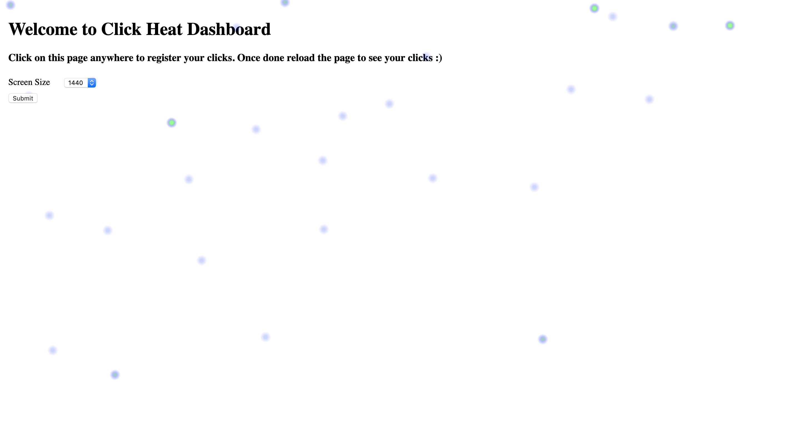

ClickHeat
===========

This code helps to register clicks and view clicks on any page.

Currently data is stored on firebase which helps for easy storage and retrieval of data.

Add your firebase config on app/index.js

Play around it.

Viewing data based on browser, varying dates will be added in future.

You can run the source code on localhost:8080

Screenshot is added for reference.
